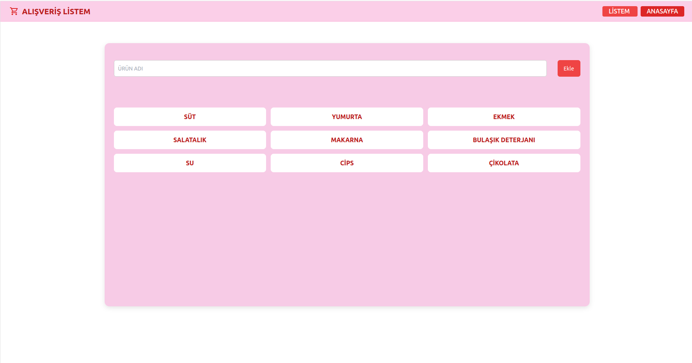

# 🛒 Alışveriş Listesi

Vue 3 + Vite kullanılarak geliştirilmiş basit ve işlevsel bir alışveriş listesi uygulaması.  
Kullanıcılar alışveriş öğelerini ekleyebilir, silebilir ve tamamlandı olarak işaretleyebilir.  
LocalStorage desteği sayesinde veriler kaybolmaz.

---

## 📌 Özellikler

✅ Yeni öğe ekleme  
✅ Öğeleri silme  
✅ Öğeleri tamamlandı olarak işaretleme  
✅ LocalStorage ile kalıcılık  
✅ Responsive ve sade tasarım  

---

## 🚀 Canlı Demo

👉 [Projeyi buradan çalıştır](https://busraygul.github.io/Alisveris-Listesi/#/)

---

## 📷 Ekran Görüntüsü




---

## 🛠 Kullanılan Teknolojiler

  
  
  
  


---

## ⚙️ Kurulum ve Çalıştırma

Projeyi kendi bilgisayarında çalıştırmak için şu adımları takip et:

```bash
# Repoyu klonla
git clone https://github.com/busraygul/Alisveris-Listesi.git

# Klasöre gir
cd Alisveris-Listesi

# Bağımlılıkları yükle
npm install

# Geliştirme sunucusunu başlat
npm run dev

# Üretim için build al
npm run build

👩‍💻 Geliştirici

[GitHub Profilim](https://github.com/busraygul)

